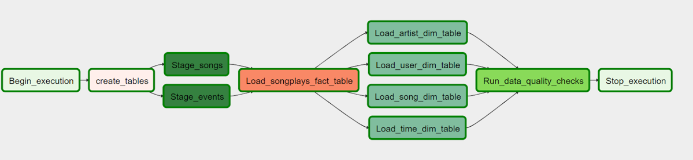

# DATA ENGINEERING NANODEGREE
# PROJECT: DATA PIPELINES WITH AIRFLOW
### SUBMITTED BY: AHMAD HATZIQ BIN MOHAMAD

# 1. Description of files in this folder

The directory of the folder is as follows:
* /images - images
* /dags/dag.py - Main DAG python file
* /plugins/helpers/sql_queries.py - Helper file containing the relevant SQL commands
* /operators
    * data_quality.py - Data Quality Operator
	* load_dimension.py - Load Dimension Table Operator
	* load_fact.py - Load Fact Table Operator
	* stage_redshift.py - Stage Redshift Operator
* README.md - this file

# 2. Summary

The above diagram shows the overall DAG of the ETL pipeline.

`Begin_execution` is a dummy operator created to start the process.

`create_tables` is a Python operator to create the tables, if they are not present in the Redshift cluster.

`Stage_songs` and `Stage_events` will load the data from S3 to the Redshift staging tables.

`Load_songplays_fact_table` will transform and load the data to the fact table. 
`Load_artist_dim_table`, `Load_user_dim_table`, `Load_song_dim_table`, `Load_time_dim_table` will transform and load the data to the respective dimension tables. Note that the option to do either TRUNCATE-LOAD or APPEND-LOAD is possible.

`Run_data_quality_checks` will perform checks on the table ie ensure there are non-zero rows available after the ETL process is executed.

`Stop_execution` is a dummy operator created to end the overall process. 

Pre-requisites:
Please ensure that the `aws_credentials` and `redshift` connections are created in Airflow. `aws_credentials` should have a AWS connector whereas `redshift` should have a Postgres connector. 

