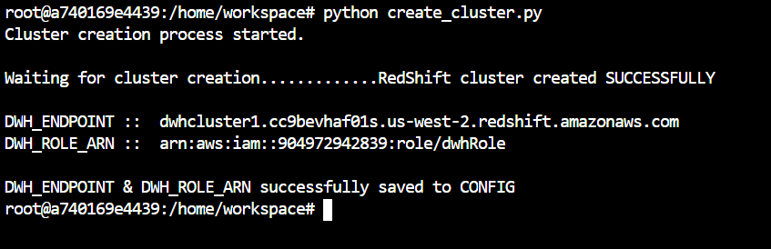
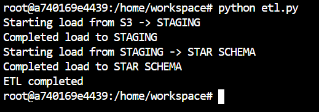
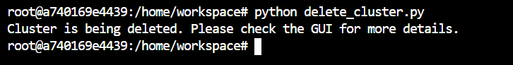
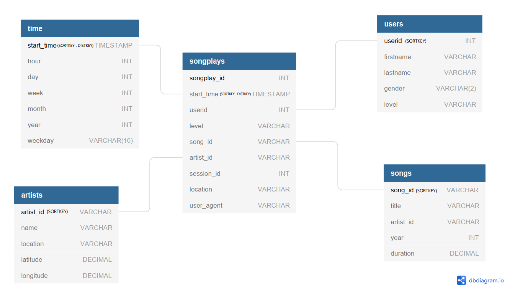

# DATA ENGINEERING NANODEGREE
# PROJECT: DATA WAREHOUSE
### SUBMITTED BY: AHMAD HATZIQ BIN MOHAMAD

## 1. Description of files in this folder

The directory of the folder is as follows:
* /images
    * star_schema.png
    * gender_pie_chart.png
* dwh.cfg - configuration file storing AWS keys (please do not circulate), DWH and S3 parameters
* cluster_create_delete.ipynb - Jupyter notebook to test creating and deleting of RedShift clusters
* sql_statements.ipynb - Jupyter notebook for testing of SQL statements
* verify_etl.ipynb - Jupyter notebook for running ad-hoc queries on final tables
* create_cluster.py - Python script to create a RedShift cluster using credentials from `dwh.cfg`
* create_table.py - Python script to `DROP` and `CREATE TABLES`. References `sql_queries.py`
* delete_cluster.py - Python script to delete a RedShift cluster using credentials from `dwh.cfg`
* etl.py - Python script to execute the ETL process
* sql_queries.py - Python script containing vital SQL statements
* README.md - this file

## 2. Introduction

For the purposes of the submission, the RedShift cluster will remain active, for the user to verify that the ETL process works. Should the user choose to use their own AWS credentials, he/she can edit the configuration file, under `[AWS][key]` and `[AWS][secret]`. The `[DWH][dwh_endpoint]` and `[DWH][dwh_endpoint]` will auto update once the `create_cluster.py` script is executed.

## 3. Execution

### 3.1. Cluster Creation
The RedShift cluster can be created by running the `create_cluster.py` script ie `python create_cluster.py`. This helps embody the principle of `Infrastructure as code (IaC) `, where infrastructure processes can be programmatically executed.

When successful, the command line should be as follows:

### 3.2. Schema & Table Creation

Once the RedShift cluster is created, running `python create_tables.py` can be executed to create the schemas and their respective tables.

### 3.3. Running ETL Process

To execute the ETL process, execute `python etl.py`. When successful, the command line should be as follows:

### 3.4. Cluster Deletion

To delete the cluster, execute `python delete_cluster.py`. When successful, the command line should be as follows:

The user should then monitor the Amazon RedShift console to see when the cluster deletion process has completed.

## 4. Purpose of database & analytical goals

The purpose of this database is to support Sparkify in their analytics. Sparkify can execute most queries with minimal joins. This database will support OLAP workloads rather than OLTP workloads. The ETL process will help automate the process of managing the datawarehouse. Sparkify can then automatically update their source files to update the views on their BI applications.

### 4.1. Loading Data from S3 to RedShift Staging
The source files are located at the S3 bucket `s3://udacity-dend/`. There are 2 main files, `log_data` and `song_data`, both found in `.json` formats. 

The `COPY` command is used to bulk insert the data. There are no transformations done to the data, except to typecast variables to `INT / DECIMAL` etc.

To differentiate between the staging and star schema tables, 2 schemas are created, `staging_schema` and `star_schema`.

### 4.2. Loading & Transforming Data from RedShift Staging to Star Schema Tables
Before the ETL process is executed, the Fact & Dimension Tables are created. 

Transformation of the data is done, in particular for the `TIMESTAMP` column and the `songplays` table. 

To optimize the table design, distribution and sorting keys are used. The aim is to speed up queries against the star schema tables. 

The primary keys are used as sorting keys so that rows with similar IDs are grouped together. This is as we do not know what queries Sparkify will run against their data. Hence, sorting keys using the primary keys serves as a good starting point.

Additionally, the distribution keys are used for the `TIMESTAMP` columns. This can be useful if Sparkify wants to query data according to their time periods.

### 4.3. Star Schema Design 

The data model has 5 tables: 4 dimension tables and 1 fact table.

Table name: `songplays`
Type: Fact Table
| COLUMN  | TYPE  | ADDITIONAL INFO|
| ------------- | ------------- | --|
| songplay_id  | INT  | PRIMARY KEY, IDENTITY(0,1) |
| start_time  | INT  | SORTKEY, DISTKEY |
| userid  | INT  | --|
| level  | VARCHAR  | --|
| song_id  | VARCHAR  | --|
| artist_id  | VARCHAR  | --|
| session_id  | INT  | --|
| location  | TEXT  | --|
| user_agent  | TEXT  | --|

Table name: `time`
Type: Dimension Table
| COLUMN  | TYPE  | ADDITIONAL INFO|
| ------------- | ------------- | --|
| start_time  | TIMESTAMP | PRIMARY KEY, SORTKEY, DISTKEY |
| hour  | INT  | --|
| day  | INT  | --|
| week  | INT  | --|
| month  | INT  | --|
| year  | INT  | --|
| weekday  | VARCHAR(10) | --|

Table name: `artists`
Type: Dimension Table
| COLUMN  | TYPE  | ADDITIONAL INFO|
| ------------- | ------------- | --|
| artist_id  | VARCHAR  | PRIMARY KEY, SORTKEY |
| name  | VARCHAR  | --|
| location  | VARCHAR  | --|
| latitude  | DECIMAL  | --|
| longitude  | DECIMAL  | --|
Рађ
Table name: `users`
Type: Dimension Table
| COLUMN  | TYPE  | ADDITIONAL INFO|
| ------------- | ------------- | --|
| userid  | INT  | PRIMARY KEY, SORTKEY |
| first_name  | VARCHAR  | --|
| last_name  | VARCHAR  | --|
| gender  | VARCHAR(2)  | --|
| level  | VARCHAR  | --|

Table name: `songs`
Type: Dimension Table
| COLUMN  | TYPE  | ADDITIONAL INFO|
| ------------- | ------------- | --|
| song_id  | VARCHAR  | PRIMARY KEY, SORTKEY |
| title  | VARCHAR  | --|
| artist_id  | VARCHAR  | --|
| year  | INT  | --|
| duration  | DECIMAL  | -|

## 4.4. Data Analysis

To test the data from the final tables, some queries are run against the data. The code can be found in `verify_etl.ipynb`.

### 4.1. Analysis of most popular browsers
To ascertain the most popular browser, the command `SELECT DISTINCT user_agent FROM songplays;` was executed. The dominant 3 browsers (irrespective of version) are Google Chrome, Firefox and Safari.

The counts are as follows:
| Browser  | ROW COUNT  |
| ------------- | -------------|
| Firefox  | 88 |
| Chrome  | 187 |
| Safari  | 244 |

People who use Safari are generally Apple Macintosh or iOS users. Hence, perhaps Sparkify could run more campaigns to target users from Windows and Android to use its applications.

### 4.2. Analysis of user genders
To get the breakdown of user genders, the following command was executed: `SELECT users.gender, COUNT(*)  FROM songplays JOIN users ON songplays.user_id = users.user_id GROUP BY users.gender;`.

The counts are as follows:
| Gender  | COUNT  |
| ------------- | -------------|
| Female  | 98186 |
| Male  | 17586 |

A pie chart visualization is below. 

A large proportion of the users are females. Perhaps more changes can be done to target more male users to use Sharkify's services.

 

